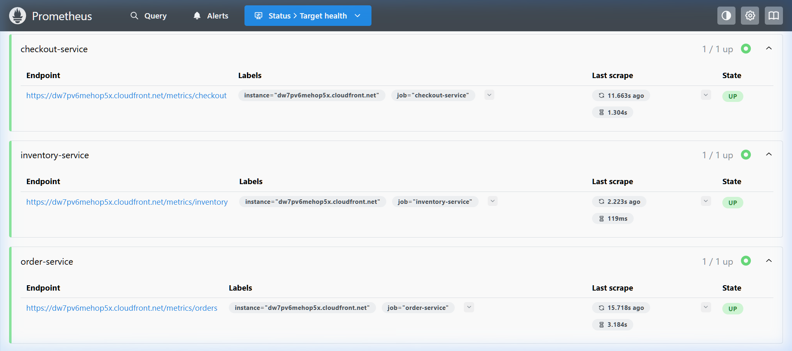
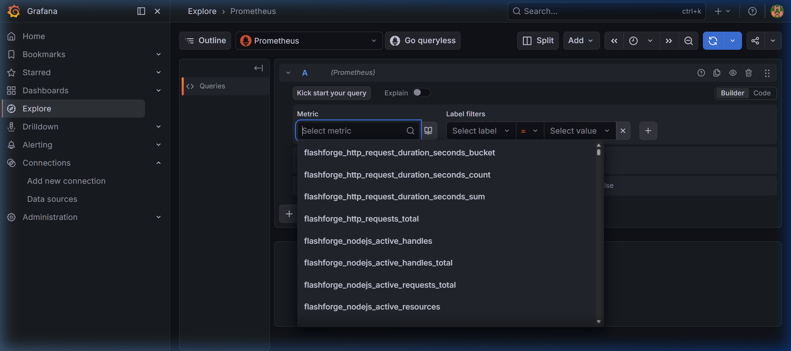

# FlashForge Commerce

> **Production-grade flash-sale e-commerce platform** built on Node.js microservices, hosted on **AWS EC2 behind CloudFront (HTTPS)**, demonstrating high-concurrency checkout orchestration, inventory oversell prevention, idempotent payments, async event processing, and full observability via Prometheus + Grafana.

<div align="center">

[](https://dw7pv6mehop5x.cloudfront.net)
[](LICENSE)
[](https://nodejs.org)
[](https://www.typescriptlang.org)
[](https://aws.amazon.com)

</div>

---

## 📸 Live Screenshots

### 🛒 Storefront — Live on AWS CloudFront (HTTPS)

> Live at **[https://dw7pv6mehop5x.cloudfront.net](https://dw7pv6mehop5x.cloudfront.net)** — Next.js 15 frontend served via AWS CloudFront with TLS termination.

---

### 📦 Storefront Features


> Instant Checkout (idempotent API design), Safe & Secure payments, and Real-time Stock tracking across microservices.

---

### 📡 Prometheus — All Microservices Scraped via CloudFront HTTPS

> All 5 microservices (**checkout, inventory, order, payment, product**) report **UP** to local Prometheus — scraped securely through `https://dw7pv6mehop5x.cloudfront.net/metrics/<service>` using Bearer token auth.

---

### 📊 Grafana — Service Overview Dashboard


> Auto-provisioned Grafana dashboard at `localhost:3001` connected to Prometheus, with panels for HTTP Requests/sec, p95 Latency, 5xx Error Rate, and Checkout/Payment Success Rate.

---

### 🔬 Grafana Explore — Live `flashforge_*` Metrics

> `flashforge_http_requests_total`, `flashforge_http_request_duration_seconds`, and custom Node.js metrics flowing live from production into Grafana Explore.

---


## 🏗️ Architecture

<<<<<<< Updated upstream
=======
```
Browser / Prometheus (local)
        │
        ▼
┌─────────────────────────────────────────┐
│         AWS CloudFront (HTTPS)          │  ← TLS termination, CDN
│     dw7pv6mehop5x.cloudfront.net        │
└───────────────┬─────────────────────────┘
                │ http (origin-only)
                ▼
┌───────────────────────────────────────────────────────────┐
│               AWS EC2 t3.micro (ap-south-1)               │
│  ┌───────────────────────────────────────────────────┐    │
│  │         Nginx (port 80) — auto worker procs       │    │
│  │  /api/products  →  product-service:4001           │    │
│  │  /api/inventory →  inventory-service:4002         │    │
│  │  /api/checkout  →  checkout-service:4003 ⚡RL    │    │
│  │  /api/payments  →  payment-service:4004           │    │
│  │  /api/orders    →  order-service:4005             │    │
│  │  /metrics/*     →  <service>/metrics (authed)     │    │
│  │  /              →  Next.js frontend:3000          │    │
│  └───────────────────────────────────────────────────┘    │
│                                                            │
│  product-service   ──► MongoDB Atlas (products)           │
│  inventory-service ──► MongoDB Atlas (inventory, Prisma)  │
│  checkout-service  ──► ⚡inventory-service (CB*)          │
│                    ──► ⚡payment-service  (CB*)           │
│                    ──► CloudAMQP RabbitMQ                 │
│  payment-service   ──► MongoDB Atlas (payments)           │
│  order-service     ──► MongoDB Atlas (orders)             │
│  worker-service    ──► RabbitMQ [main→retry→DLQ]         │
│                    ──► order-service + inventory-service  │
└───────────────────────────────────────────────────────────┘

⚡RL = Nginx rate-limited (20 req/s per IP, burst 30)
CB*  = opossum circuit breaker (5s timeout, trips at 50% errors, resets in 15s)
DLQ  = 3-attempt retry with 5s TTL delay before permanent dead-letter queue
```
>>>>>>> Stashed changes


## 🚀 Quick Start

### Prerequisites

- [Docker Desktop](https://www.docker.com/products/docker-desktop/) (with Compose v2)
- Node.js 20+ and pnpm (for local dev only)

### One-command boot (Docker — all services)

```bash
# From the repo root:
docker compose -f infra/docker-compose/docker-compose.yml up --build
```

| URL | Service |
|---|---|
| http://localhost:3000 | **Storefront** (Next.js) |
| http://localhost:9090 | Prometheus |
| http://localhost:3001 | Grafana (`admin`/`admin`) |

### Local Development (hot-reload)

```powershell
pnpm install
docker compose -f infra/docker-compose/docker-compose.yml up redis rabbitmq -d
.\start-dev.ps1
```

---

## ☁️ Production Deployment (AWS)

### Infrastructure (Terraform)

```bash
cd infra/terraform
terraform init
terraform apply    # Provisions VPC, EC2, EIP, SSM, CloudFront
```

Terraform provisions:
- **VPC** with public subnet in `ap-south-1`
- **EC2 t3.micro** with IAM role for SSM access
- **Elastic IP** for stable addressing
- **CloudFront distribution** fronting EC2 on port 80
- **SSM Parameter Store** for all secrets (DB URLs, Redis, RabbitMQ, `METRICS_TOKEN`)

### Secrets Management (AWS SSM)

All secrets live in SSM Parameter Store under `/flashforge/*`:

```bash
# Fetch a secret manually
aws ssm get-parameter --name /flashforge/METRICS_TOKEN --with-decryption --output text
```

### Deploy

The GitHub Actions workflow (`deploy.yml`) on push to `main`:
1. Builds Docker images → pushes to **GHCR**
2. SCPs `docker-compose.prod.yml` + `nginx.conf` to EC2
3. SSH: `docker compose pull && docker compose up -d`

---

## 🔑 Key Design Decisions

### 1. Inventory Reservation with TTL (No Oversell)
Inventory is **reserved** (not decremented) in Redis with a 10-minute TTL before checkout:
- Concurrent requests see correct stock levels
- Abandoned carts auto-release after TTL
- Actual decrement only happens after payment confirmation

### 2. Idempotent Payments
Every payment request includes a `sessionId`. The payment service stores results keyed by `sessionId` — duplicate retries return the cached outcome, preventing double charges.

### 3. Async Order Creation via Saga Pattern
Checkout does not wait for order creation:
1. Payment response is immediate (sync)
2. A `payment_completed` event is published to RabbitMQ
3. Worker Service consumes it and creates the order
4. **payment_failed** → Worker releases inventory reservation (compensating transaction)

### 4. Secure Metrics via CloudFront
Production `/metrics` endpoints require a **Bearer token** (`METRICS_TOKEN`) and are exposed only through CloudFront HTTPS. Local Prometheus scrapes them using `authorization` config — no ports opened beyond 80.

### 5. Circuit Breakers on Inter-Service HTTP Calls
`checkout-service` wraps all calls to `inventory-service` and `payment-service` in **opossum circuit breakers**:
- Trips after 50% error rate over a 10-second window (min. 5 requests)
- Open breaker fails immediately (no 30s Nginx timeout hang)
- Automatically probes after 15s and closes on recovery
- Logs state transitions (`OPEN → HALF-OPEN → CLOSED`) for observability

### 6. RabbitMQ Three-Tier Message Topology
Failed messages are never silently dropped:
1. **Main queue** → message nacked → goes to **retry queue** (5s TTL)
2. **Retry queue** → TTL expires → re-delivered to main queue
3. After **3 attempts**, message routes to **permanent DLQ** (`.dlq`)

Workers use `channel.prefetch(1)` to prevent a single stuck message from blocking the entire consumer.

### 7. Health-Gated Service Startup
`docker-compose.prod.yml` uses `condition: service_healthy` on all critical `depends_on` entries — checkout only starts accepting traffic after inventory and payment confirm `/health` returns 200.

### 8. Hardened Infrastructure
- **Nginx**: `worker_processes auto` (all cores), `worker_connections 1024`, rate-limiting on `/api/checkout` (20 req/s per IP, burst 30)
- **Security Group**: SSH port 22 removed — access via `aws ssm start-session` (no open internet ports beyond HTTP 80)
- **Terraform state**: S3 backend config ready-to-enable in `versions.tf` with a `bootstrap-state.sh` provisioning script

---

## 📊 Observability

### Prometheus Targets (Production)
All services scraped via `https://dw7pv6mehop5x.cloudfront.net/metrics/<service>`:

```yaml
# prometheus.yml (snippet)
- job_name: "product-service"
  metrics_path: "/metrics/product"
  scheme: "https"
  authorization:
    type: "Bearer"
    credentials: "<METRICS_TOKEN>"
  static_configs:
    - targets: ["dw7pv6mehop5x.cloudfront.net"]
```

### Custom Metrics Exposed
All services expose via `/metrics`:
- `flashforge_http_requests_total` — labelled by `method`, `path`, `status_code`, `service`
- `flashforge_http_request_duration_seconds` — histogram (p50/p95/p99)
- `flashforge_nodejs_*` — Node.js runtime metrics

### Alerting Rules (`infra/docker-compose/alerts.yml`)
Prometheus evaluates alerting rules every 15s covering:
- **ServiceDown** — any scrape target unreachable for >1 min (critical)
- **CheckoutHighErrorRate** — checkout 5xx rate >5% for 2 min (critical)
- **PaymentHighErrorRate** — payment 5xx rate >2% for 2 min (critical)
- **CheckoutHighLatency** — p95 checkout latency >2s for 3 min (warning)
- **HighHeapUsage** — Node.js heap >90% for 5 min (warning)
- **HighEventLoopLag** — event loop lag >500ms for 3 min (warning)

> To route alerts to Slack/email, add an Alertmanager service and configure `alerting:` in `prometheus.yml`.

### Grafana Dashboard
Auto-provisioned at `http://localhost:3001` → **FlashForge Commerce / Service Overview**:
- HTTP requests/sec per service
- p95 latency per service
- 5xx error rate
- Checkout & payment success panels

---

## 🧪 Load Testing

```bash
# Full checkout flow load test (progressive ramp → spike)
k6 run load-tests/k6/checkout-load.js

# Flash-sale stress test (500 buyers, 100 items — validates no oversell)
k6 run load-tests/k6/inventory-stress.js
```

**Default thresholds:**
- Checkout p95 latency < 2000ms
- Reservation p95 latency < 500ms
- Checkout success rate > 70%
- HTTP error rate < 5%

---

## 📁 Project Structure

```
FlashForge Commerce/
├── services/
│   ├── product-service/     Port 4001 — Product CRUD + /metrics
│   ├── inventory-service/   Port 4002 — Stock reservation (Prisma TX)
│   ├── checkout-service/    Port 4003 — Checkout orchestration + circuit breakers
│   ├── payment-service/     Port 4004 — Idempotent payment gateway
│   ├── order-service/       Port 4005 — Order management
│   └── worker-service/      Port 4006 — RabbitMQ saga consumer (retry + DLQ)
├── frontend/                Next.js 15 App Router storefront
├── packages/
│   ├── shared-types/        Shared TypeScript interfaces
│   ├── shared-config/       Env config helpers
│   ├── shared-logger/       Structured Pino logging
│   ├── shared-metrics/      Prometheus middleware (prom-client)
│   └── shared-rabbitmq/     RabbitMQ connection factory + retry topology
├── infra/
│   ├── docker-compose/      Docker Compose + Nginx + Prometheus + Grafana
│   │   ├── docker-compose.yml        Local dev stack
│   │   ├── docker-compose.prod.yml   Production stack (health-gated startup)
│   │   ├── nginx.conf                Reverse proxy + rate limiting + /metrics routing
│   │   ├── prometheus.yml            Scrape config (CloudFront HTTPS) + alert rules
│   │   └── alerts.yml                Prometheus alerting rules (latency, errors, health)
│   ├── terraform/
│   │   ├── main.tf                   Root module (VPC + EC2 + CloudFront)
│   │   ├── versions.tf               Provider versions + S3 backend (ready to enable)
│   │   ├── bootstrap-state.sh        One-command S3 + DynamoDB state backend setup
│   │   └── modules/
│   │       ├── vpc/                  VPC, subnet, IGW
│   │       ├── ec2/                  Instance, SG (SSH removed), IAM, userdata
│   │       ├── ssm/                  Parameter Store secrets
│   │       └── cloudfront/           HTTPS CDN distribution
│   └── scripts/
│       └── setup-env.sh              Re-creates /etc/flashforge.env from SSM
├── docs/screenshots/        Live project screenshots for README
└── load-tests/k6/           k6 load & stress tests
```

---

## 📄 Docs

- [Architecture Deep-Dive](docs/architecture.md)
- [API Reference](docs/api.md)
- [Development Guide](docs/development.md)
